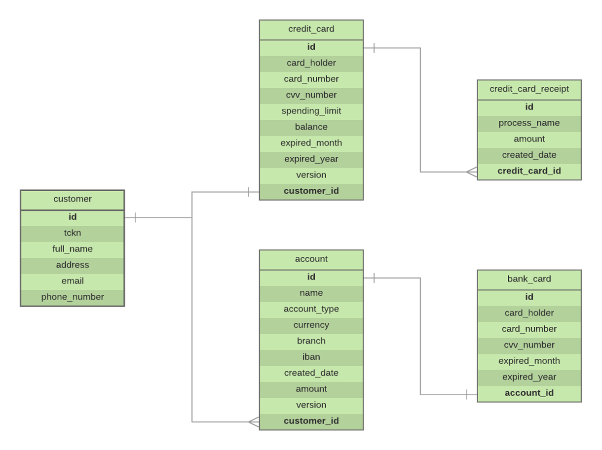
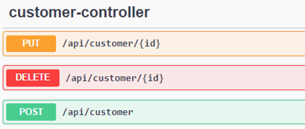
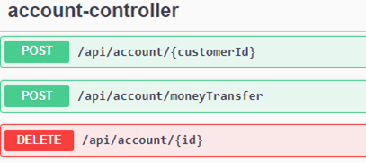
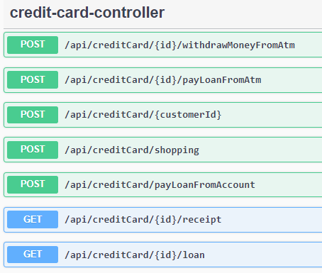
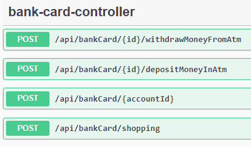

# Bank Management System

Bank management system includes customer management, account management, card management and money transfer management. The exchange rate difference between accounts belonging to different currencies to be transferred is made by withdrawing from the API. This project includes OneToOne, OneToMany and ManyToOne relationships.

## Tools and technologies utilized in this project:

- Java 8
- Spring Boot
- Maven
- Spring Data JPA
- MySQL
- Git
- IntelliJ IDEA

## ER Diagram

## Endpoints

